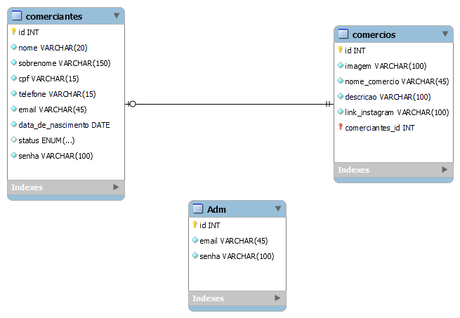

<!--  Crie um banco   -->
```sql
CREATE DATABASE vale_a_penha CHARACTER SET utf8mb4;
```

<!-- Criar tabela COMERCIANTES  -->
```sql
CREATE TABLE comerciantes(
    id INT NOT NULL PRIMARY KEY AUTO_INCREMENT,
    nome VARCHAR(20) NOT NULL,
    sobrenome VARCHAR(150) NOT NULL,
    cpf VARCHAR(15) NOT NULL,
    telefone VARCHAR(15) NOT NULL,
    email VARCHAR(45) NOT NULL,
    data_de_nascimento DATE(15) NOT NULL,
    status ENUM('ativo', 'inativo') DEFAULT 'inativo' NULL,
    senha VARCHAR(100) NOT NULL   
); 
```

<!-- Criar tabela COMERCIOS  -->
```sql
CREATE TABLE comercios(
    id INT NOT NULL PRIMARY KEY AUTO_INCREMENT,
    imagem VARCHAR(100) NOT NULL,
    nome_comercio VARCHAR(45) NOT NULL,
    descricao VARCHAR(100) NOT NULL,
    link_instagram VARCHAR(100) NOT NULL,
    comerciante_id INT NULL       
); 
```

<!-- Criar tabela ADMINISTRADORES  -->
```sql
CREATE TABLE administradores(
    id INT NOT NULL PRIMARY KEY AUTO_INCREMENT,
    email VARCHAR(45) NOT NULL,
    senha VARCHAR(100) NOT NULL           
); 
```

<!--Criando a chave-estrangeira Confirmar se está correto-->

```sql
ALTER TABLE comerciantes
    
    ADD CONSTRAINT fk_comerciantes_comercios1  
    FOREIGN KEY (comerciante_id) REFERENCES comerciantes(id);

```
