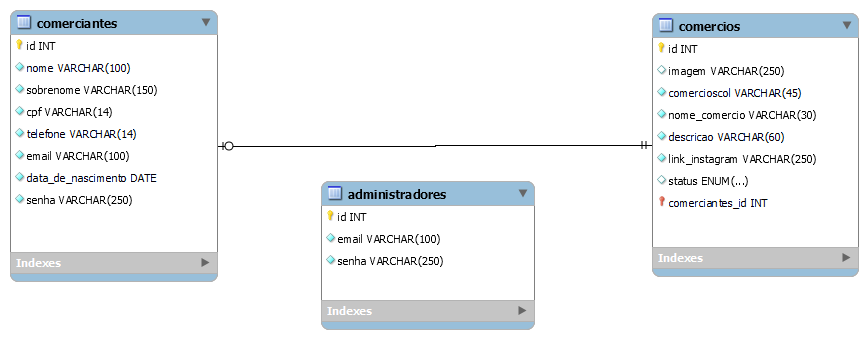

<!--  Crie um banco   -->
```sql
CREATE DATABASE vale_a_penha CHARACTER SET utf8mb4;
```

<!-- Criar tabela COMERCIANTES  -->
```sql
CREATE TABLE usuarios(
    id INT NOT NULL PRIMARY KEY AUTO_INCREMENT,
    nome VARCHAR(100) NOT NULL,
    sobrenome VARCHAR(150) NOT NULL,
    cpf VARCHAR(14) NOT NULL,
    telefone VARCHAR(14) NOT NULL,
    email VARCHAR(100) NOT NULL,
    data DATE NOT NULL,    
    senha VARCHAR(250) NOT NULL,
    tipo ENUM('admin','comerciante') NULL DEFAULT 'comerciante'      
); 
```

<!-- Criar tabela COMERCIOS  -->
```sql
CREATE TABLE comerciantes (
    id INT NOT NULL PRIMARY KEY AUTO_INCREMENT,
    imagem VARCHAR(250)  NULL,
    nome_comercio VARCHAR(50)  NULL,
    descricao VARCHAR(200) NULL,
    link_instagram VARCHAR(200)  NULL,
    status ENUM('ativo', 'inativo') NULL DEFAULT 'inativo',
    categoria_id INT DEFAULT NULL,
    usuario_id INT NULL 
         
); 
```

```sql
CREATE TABLE categorias(
    id INT NOT NULL PRIMARY KEY AUTO_INCREMENT,
    nome_categoria VARCHAR(100) NOT NULL
         
); 
```
<!--Criando a chave-estrangeira Confirmar se está correto com a opção on Delete Cascade-->
```sql
ALTER TABLE comerciantes

    ADD CONSTRAINT fk_comerciantes_usuarios
    FOREIGN KEY (usuario_id) REFERENCES usuarios(id) ON DELETE CASCADE;  
    
```

```sql
ALTER TABLE comerciantes

    ADD CONSTRAINT fk_comerciantes_categorias
    FOREIGN KEY (categoria_id) REFERENCES categorias(id) ON DELETE CASCADE;  
    
```

<!-- 	ON DELETE CASCADE – Uma operação de exclusão em uma tabela referenciada se propaga (cascade = em cascata) para as chaves estrangeiras correspondentes. Ou seja, ao excluir um registro em uma tabela, um registro relacionado em outra tabela é automaticamente excluído. Por exemplo, se uma editora de uma tabela de editoras for excluída, os livros da tabela de livros relacionados com esta editora também serão excluídos automaticamente. -->


```sql
INSERT INTO categorias(nome_categoria) VALUES('Gastronomia');
INSERT INTO categorias(nome_categoria) VALUES('Varejo');
INSERT INTO categorias(nome_categoria) VALUES('Educação');

```